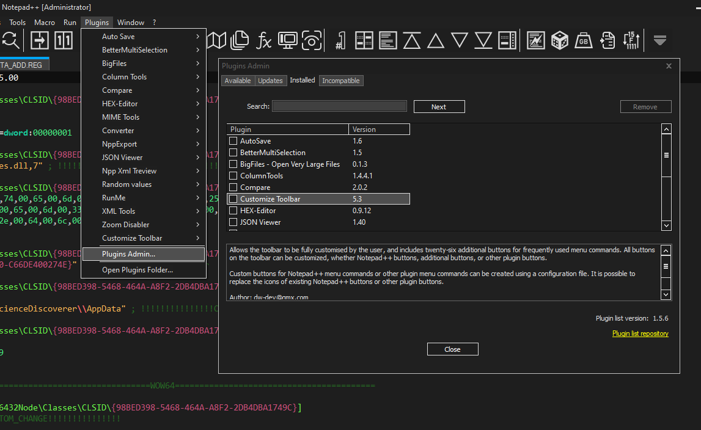
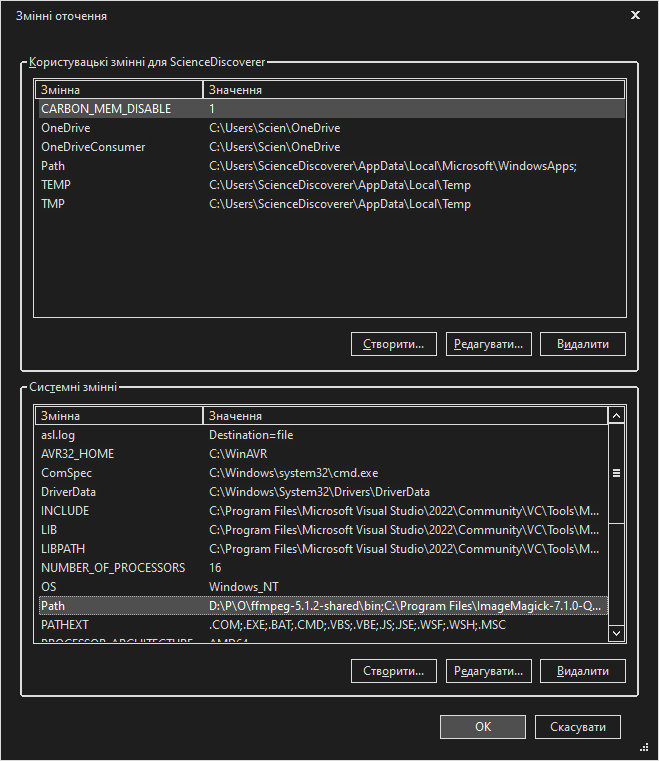

# Notepad++ MSVC IDE

[](../../releases/latest)
&nbsp;&nbsp;&nbsp;
&nbsp;&nbsp;&nbsp;[](https://www.buymeacoffee.com/sciencediscoverer)

Open source alternative for MS Visual Studio, powered by `cl` compiler. Featuring no project files, simple build process, "soft" and "hard" debuggers and `mingw`-like error output styling.


## How to build

Just double-click the `msvc_build.cmd` file. Yep. As easy as this. Well, that is, if you have your Visual Studio installed, of course. And if your VS `vcvars64.bat` file and `bin\HostX64\x64` directory are located at this paths:

```
set "bat_dir=C:\Program Files\Microsoft Visual Studio\2022\Community\VC\Auxiliary\Build\vcvars64.bat"
set "bin_dir=C:\Program Files\Microsoft Visual Studio\2022\Community\VC\Tools\MSVC\14.34.31933\bin\HostX64\x64"
```
If not, you will have to merely locate this file and directory and copy-paste them into the `msvc_build.cmd`. Then just launch it and wait until it does all the job for you. Yes, you don't even need to open the Visual Studio. Ever.

## How to setup

1. Add `Notepad++.exe` to your system `PATH` variable

2. Install `Customize Toolbar` plugin



3. Use `appdata/roaming/npp/shortcuts.xml` in this repo as an example, you can integrate all or only some of the shortcuts. Most of them are self-explanatory. The most important being: `Build C++ file` - to actually be able to build `.cpp` files, `Build all libs` - useful for rebuilding many static libraries in defined order, `Add keywords` - uses `nppautos.exe` to override default `cpp.xml` autocompletion file with your custom functions placed in the `npp_autos.h` (you might want to back up default `cpp.xml`). What macros do:

   * `REGEX_MARK_ESCAPED_CH` - marks escaped characters (`\n\r\x` etc.)
   * `FUNCS_TO_DECLS` - converts function definitions to declarations
   * `FUNCS_TO_DEFINS` - converts function declarations to definitions
   * `PATH_TO_STR_LIT` - converts windows path to C++ string literal
   * `HTML_CODE_ENTAG` - encases selected text into HTML `<code>` tag
   * `STR_LITERAL` - encases string literal into `L()`
   * `WSTR_LITERAL` - encases wide string literal into `WL()`

5. Copy the contents of `appdata/roaming/npp/plugins/config` repo folder into your `plugins/config` folder located in `C:\Users\<USERNAME>\AppData\Roaming\Notepad++\plugins\config`. Relaunch Notepad++ for changes to take effect
6. Install [Build Tools for Visual Studio 2022](https://visualstudio.microsoft.com/downloads/) (*YES, you don't even need the bloated IDE itself!*) or if you have Visual Studio already installed, skip
7. Set up environment variables, type in your Start menu: `x64 Native Tools Command Prompt for VS 2022`, launch it. If nothing is found, you will have to go digging in your `Program Files` directory to find `C:\Program Files\Microsoft Visual Studio\2022\Community\VC\Auxiliary\Build\vcvars64.bat`
8. Copy and paste following lines into the console. After each command, Ctrl+V the result into your `cmd/msvc_build.cmd` (remember, `msvc_build.cmd` located in the root of this repo is version specifically designed for building git repo and has no iteration with Notepad++) file, after the `@echo off` line:
```
echo set "PATH=%PATH%" | clip
echo set "INCLUDE=%INCLUDE%" | clip
echo set "LIB=%LIB%" | clip
echo set "LIBPATH=%LIBPATH%" | clip
```
9. Alternatively, you can set this environmental variable permanently, if you want (should result in a few milliseconds faster builds). Press Win+R, enter `rundll32.exe sysdm.cpl,EditEnvironmentVariables`. In the bottom sub-window locate `Path` variable and then add **extra** variables that was injected by the Visual Studio in the correct order (for this, compare your original `Path` to one you got from the VS console). Also add `INCLUDE`, `LIB` and `LIBPATH` variables separately from `Path`. VS documentation does not encourage this, but I never ran into any issues in a long time of using this strategy



10. In the `cmd/msvc_build.cmd` modify this lines to lead to your custom `.h` and `.lib` files so that you can use them for a program in any folder:
```
set "inc_dir=/I D:\P\MT\"
set "lib_dir=/LIBPATH:D:\P\MT\"
```
11. Set up your folder structure to make it the most convenient to use this IDE. I can give you and example of my own structure. `P` contains all the programs I ever created in one place. `MT` (*Micro Tests*) folder contains loads of my tiny programs/utilities/libraries that could be used by any "big" program in `P`. `msvc_build.cmd` file can be placed into `MT\cmd` folder. You can also add `MT\ext` folder and place all the external (not written by you personally) libraries/headers there, then have some wrapper headers in your `MT` folder that will include all the external headers/libs. For example, `MT\ext\curl\curl.h` then in your `MT` folder you can have wrapper header `curl.h` that will have `#include "ext\curl\curl.h"` this way you will never ever have to worry about changing your include/lib directory ever again

12. It's super easy, barely an inconvenience to add icon and/or manifest to your program, fast. All you have to do, is to create `res\ico` / `res\manifest` folder in your program's root folder and put icon/manifest there that will **exactly match the program's .cpp file name** (i.e. `foo.cpp` > `foo.ico` / `foo.manifest`). The CMD script will take care of all the annoying parts of actually generating and compiling and linking resource files. Oh, and you can put `main.ico` / `main.manifest` in the `res\ico` / `res\manifest` folder. This will get used by default for all your programs without any dedicated `program_name.ico` / `program_name.manifest` files. You can also create `res\rc` folder and put custom `program_name.rc` files there. If such a file will be detected, it will be used instead of generating automatic `.rc` file

13. `cmd/msvc_build.cmd` uses 3 little utilities: `errlogkill`, `eline2npp` and `vcstyle`. You should place them in the folder included into `PATH` variable, or hardcore absolute paths to them in the `cmd/msvc_build.cmd`. What `errlogkill` does, it, basically, just sends Windows message to the Notepad++ that forces it to save current file and it also sends termination messages to the error/warning console windows. This frees you from having to constantly remember to SAVE THE FILE after you quickly corrected some error, which greatly aids workflow. All you have to do is press the `Build CPP file` button. `eline2npp` is responsible for automatically jumping to the first or clicked error/warning, and highlighting it in Notepad++. `vcstyle` is a pipe that styles almost unreadable raw `cl.exe` output into `mingw`-like colour coded goodness

14. You can integrate some or all of the custom context menu entries. Use `appdata/roaming/npp/contextMenu` and copy entries to your own. You can also copy some `userDefineLang`-s from there. It has styling for `.cod` ASM output files, `.log` files and markdown.

15. Last but not least, install `sdpp` plugin. It is very important as it adds many useful features but also serves as communication link between Notepad++ and `eline2npp` and `sddb` debugging library. Just copy `sdpp.dll` into your Notepad++ `plugins_folder\sdpp\sdpp.dll` and restart NPP.

16. Profit! You are ready for rapid C/C++ development in Notepad++!

## How to create project file?
There is no project files. No need for them at all. You can control compilation of individual programs easily from the source file itself by including comment in the top of your source file like this:

```
// CONSOLE DBG NOPT
```
`CONSOLE` - compile program as console application (default - `SUBSYSTEM:WINDOWS`)

`DSEH` - disable C++ STD SEH handling (if you need to `__try() __except()` in functions with objects)

`NOPT` - disable all optimisations

`NW` - disable all warnings (default - `wall`)

`SLIB` - do not link, assemble into static library

`DLIB` - compile as dynamic library (DLL)

`DLLIE` - produce DLL export and import libraries (default - only `.dll` is produced)

`ASM` - instead of compiling to `.exe` file, open MASM code created by the compiler in Notepad++ (aka. your own Compiler Explorer)

`DBG` - compile in debug mode and launch resulting executable with `sddbg` debugger attached

`NLAUNCH` - just compile and link, no automatic launch

`EPMAIN` - use `main` instead of `wmain` as an entry point

The idea here is like this - `cmd/msvc_build.cmd` is your base "master" project ~~file~~ script that is used in all the programs. And each program tweaks it's behaviour from it's own source code. This avoids the need to have useless files lying around and makes all your projects consistent.

## Full video

[](http://www.youtube.com/watch?v=fGzSS2IgEiM "Notepad++ C++ IDE")

## Other stuff

[What is `p|DC|TB|P;`](https://github.com/ScienceDiscoverer/sd_std_libs)?


*Note: building single `.exe` / `.dll` from multiple `.cpp` files is currently not supported. I didn't had any need for this feature yet, but I plan to add it in the future, when the need arises.*
