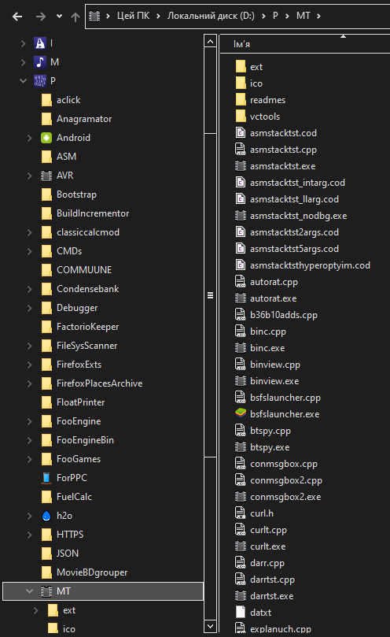

# Notepad++ MSVC IDE

Compile any `.cpp` file instantly with the press of a button:


Get pretty error/warning/note output:


Featuring custom debugger:


How to setup:
1. Install `Customize Toolbar` plugin


2. Use `shortcuts.xml` in this repo as an example, but don't overwrite your own! Add this `Command` in your own `shortcuts.xml` file located in your Notepad++ profile `C:\Users\<USERNAME>\AppData\Roaming\Notepad++`. You can also add usefull macroses to quickly add simple breakpoints, debug prints etc:
```
<UserDefinedCommands>
  <Command name="Build C++ file" Ctrl="yes" Alt="yes" Shift="yes" Key="115">D:\<PATH_TO_FOLDER_WITH_CMD>\msvc_build.cmd $(NAME_PART) $(CURRENT_DIRECTORY)</Command>
</UserDefinedCommands>
 ```
3. Copy the contents of `plugins/config` repo folder into your `plugins/config` folder located in `C:\Users\<USERNAME>\AppData\Roaming\Notepad++\plugins\config`. Relaunch Notepad++ for changes to take effect.
4. Install [Build Tools for Visual Studio 2022](https://visualstudio.microsoft.com/downloads/) (*YES, you don't even need the bloated IDE itself!*) or if you have Visual Studio already installed, skip
5. Set up environment variables, type in your Start menu: `x64 Native Tools Command Prompt for VS 2022`, launch it.
6. Copy and paste following lines into the console. After each command, Ctrl+V the result into your `msvc_build.cmd` file, after the `@echo off` line:
```
echo set "PATH=%PATH%" | clip
echo set "INCLUDE=%INCLUDE%" | clip
echo set "LIB=%LIB%" | clip
echo set "LIBPATH=%LIBPATH%" | clip
```
7. Alternatively, you can set this environmental variable permanently, if you want (should result in a few milliseconds faster builds). Press Win+R, enter `rundll32.exe sysdm.cpl,EditEnvironmentVariables`. In the bottom sub-window locate `Path` variable and then add **extra** variables that was injected by the Visual Studio in the correct order (for this, compare your original `Path` to one you got from the VS console). Also add `INCLUDE`, `LIB` and `LIBPATH` variables separately from `Path`. VS documentation does not encourage this, but I never ran into any issues in a long time of using this strategy.


8. In the `msvc_build.cmd` modify this lines to lead to your custom `.h` and `.lib` files so that you can use them for a program in any folder:
```
set "inc_dir=/I D:\P\MT\"
set "lib_dir=/LIBPATH:D:\P\MT\"
```
9. Set up your folder structure to make it the most convenient to use this tool. I can give you and example of my own structure. `P` contains all the programs I ever created in one place. `MT` (*Micro Tests*) folder contains loads of tiny programs/utilities/libraries  I created that could be used by any "big" program in `P`. `msvc_build.cmd` file must be located in the `P` folder for all this system to work.



10. There is useful feature with the icons. It's super easy, barely an inconvenience to add icon to your program, fast. All you have to do, is to create `ico` folder in your program's root folder and put icon into it that will **exactly match the program's .cpp file name** (i.e. foo.cpp > foo.ico). The CMD script will take care of all the annoying parts of actually compiling resource files, etc. Oh, and in your `MT` (or however you would like to call it) folder, you can put `main.ico` in the `ico` folder. This will get used by default for all the programs in the `MT` folder without any dedicated `program_name.ico` file.
11. There is 3 custom made little utilities in the `msvc_build.cmd`. `nppsave`, `vcstyle` and `binc`. What `nppsave` does, it, basically, just sends Windows message to the Notepad++ that forces it to save current file. This frees you from having to constantly remember to SAVE THE FILE after you quickly corrected some error, which greatly aids workflow. All you have to do is press the `Build CPP file` button. When first setting this up, just comment out `nppsave` with `REM` or `::`. Put the `nppsave.cpp` file into your `MT`-analogue folder and open it in NP++. You can then compile it just by pressing `Build CPP file` button. If you want, you can add `MT` folder into your `Path` variable, or just paste full path to `nppsave.exe` (do the same with `vcstyle` and `binc`).
12. `vcstyle` utility styles ugly and unreadable default output of VS compiler akin to MinGW. Again, remove it at the first setup and compile with the Notepad++ if you don't want to use my [releases](https://github.com/ScienceDiscoverer/npp_msvc_ide/releases)
13. `binc` utility lets you automatically increment build number on your program. Note: this only increments global variables inside the program, not VERSIONINFO resource baked into `.exe` file. To use it, use `// BINC` command in the first line of your `.cpp` file. Make sure to create header file called `<CPPFILENAME>_ver.h` in the folder where your `.cpp` file is located and `#include`-ed into it. It must have content provided below. `last_success_build` and `const int build` will get updated automatically before the compilation. If the build fails due to errors, `const int build` will be decremented and so, will not change until you fix the errors:
```
// last_success_build 2022.10.27_17:11:40_GMT+2
const int major = 1;
const int minor = 0;
const int patch = 0;
const int build = 0;
```
14. You might also want to add Notepad++ `Program Files` installation folder to your `Path` or just paste the full path to the `Notepad++.exe` in this line `if "%asm%"=="/FAcsu" notepad++ %name%.cod & goto :cleanup`
15. Profit! You are ready for rapid C/C++ development in Notepad++!

You can control compilation easily from the source file itself by including comment in the top of your source file like this:
```
// CONSOLE DBG NOPT
```
`CONSOLE` - compile program as console application (default - `SUBSYSTEM:WINDOWS`)

`DSEH` - disable C++ STD SEH handling (if you need to `__try() __except()` in functions with objects)

`NOPT` - disable all optimisations

`NW` - disable all warnings

`SLIB` - compile as static library

`ASM` - instead of compiling to `.exe` file, open MASM code created by the compiler in Notepad++ (aka. your own Compiler Explorer)

`DBG` - compile in debug mode and launch resulting executable with `sddbg` debugger

`NLAUNCH` - just compile, don't launch the executable

`BINC` - use Automatic Build Incrementor utility

`EPMAIN` - use `main` instead of `wmain` as an entry point

[What is `p|TB|P;`](https://github.com/ScienceDiscoverer/sd_std_libs)?


*Note: this set of tools works with the latest version of Notepad++ `8.4.7 64 bit`. But it should also work with earlier versions of NP++ without a problems.*
